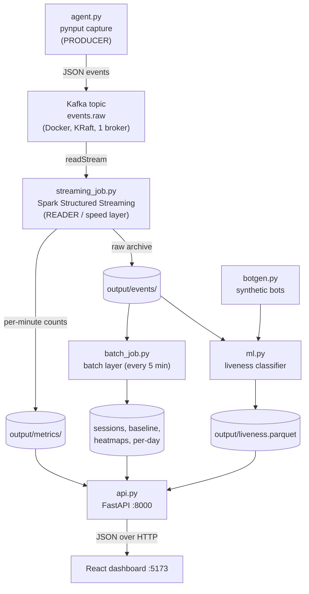

# KeySpark - Backend Study Guide

> [!summary] Goal of this note
> By the end you can walk your professor through **every backend file**, in the
> order data flows, and answer: Kafka architecture, where Kafka lives / what it
> writes / how, the producer and reader, Spark Streaming, pre-processing, windows,
> the ML, and the data visualization. Each code block has a plain-English meaning,
> a **real-life analogy**, and a **how-to-adjust** note.

> [!tip] How to read this in Obsidian
> The headings build the right-hand outline. Coloured boxes are Obsidian
> *callouts*: 🍴 = analogy, 🎛️ = a setting you can change, ❓ = a question your
> professor may ask. Click a `> [!faq]-` box to fold/unfold it.

---

## 0. The whole thing in one paragraph

KeySpark watches a computer's **keyboard and mouse**, turns every action into a
tiny **JSON message**, and pushes those messages through **Apache Kafka** (a
durable message log). **Apache Spark Structured Streaming** reads that stream and,
**every minute**, counts how much activity happened (keystrokes, words,
corrections, clicks) - that is the fast "speed layer". Separately, a **Spark batch
job** re-reads the whole saved history every 5 minutes to compute deeper things
(typing sessions, per-user averages, mouse heatmaps). A small **machine-learning**
model then decides, per minute, whether the activity looks like a **real human or
input automation** (a mouse jiggler / auto-clicker). Finally a **FastAPI** server
hands all results to a **React dashboard** as JSON. This split (fast streaming +
correct batch) is the classic **Lambda architecture**.

> [!example] 🍴 Master analogy: a busy restaurant
> Keep this picture in your head for the whole talk.
> - **agent.py** = a waiter who writes a ticket for *every single action* a guest makes.
> - **Kafka** = the metal **order rail** the tickets get pinned to, in order. The kitchen pulls tickets off at its own pace, and the tickets are *kept* so you can re-read the whole shift later.
> - **Spark Streaming** = the line cooks who, *every minute*, tally how many of each dish was ordered.
> - **Window** = one minute's stack of tickets.
> - **Watermark** = "wait a few seconds for a slow waiter's late ticket before we declare that minute's tally final."
> - **Batch job** = the manager at closing time reading the *whole* logbook to compute table sessions, averages, and the busiest areas.
> - **ML model** = a bouncer who looks at the ordering pattern and asks "is this a real hungry guest, or a machine placing fake identical orders?"
> - **API + dashboard** = the screen on the wall showing the manager live stats.

### Data flow diagram



> [!info] The "Big Data" framing your professor wants
> - **Volume / Velocity**: an *unbounded, high-rate* stream of input events.
> - **Streaming**: process data continuously as it arrives, not in one big file.
> - **Event-time windowing**: group by *when the action happened*, not when we processed it.
> - **Fault tolerance**: Kafka keeps the log; Spark checkpoints; the system survives sleep/wake.
> - **Lambda architecture**: a fast *speed layer* (streaming) + a correct *batch layer*.

---

## 1. Foundation: what is one "event"?

Everything is built on one tiny record. The agent emits one JSON object per action:

```json
{"type": "key_down", "key": "a", "user": "user-001", "ts": 1717689600.123}
{"type": "move", "x": 812, "y": 455, "user": "user-001", "ts": 1717689600.20}
{"type": "click", "x": 812, "y": 455, "button": "Button.left", "pressed": true, "user": "user-001", "ts": 1717689601.0}
```

The full schema (the columns every later stage agrees on):

| field | meaning |
| --- | --- |
| `type` | `key_down`, `key_up`, `move`, `click`, `scroll` |
| `key` | which key (only for key events) |
| `x`, `y` | pointer position (mouse events) |
| `button`, `pressed` | click button + down/up |
| `dx`, `dy` | scroll deltas |
| `user` | who produced it (e.g. `user-001`) |
| `ts` | **event time** in epoch seconds (a float) - the most important field |

> [!warning] Privacy point (good to mention)
> `key` stores a **stable identifier only** (the character or a name like
> `Key.space`) for *counting and timing*. ==Raw typed text is never stored.==

---

## 2. `agent.py` - capture + the Kafka **producer**

This is the **first backend file**: it captures input and *produces* messages into
Kafka. It is the only part that must run natively on the Mac (a Docker container
cannot see the host's keyboard/mouse).

### 2.1 The settings (top of the file)

```python
USER_ID = "user-001"                 # tune: user id stamped on every event
KAFKA_BOOTSTRAP = "localhost:9092"   # tune: Kafka broker address
KAFKA_TOPIC = "events.raw"           # tune: destination topic
MOVE_MIN_INTERVAL = 0.020            # tune: min s between mouse-move events (~50/s cap)
```

> [!example] 🍴 Analogy
> The waiter's basic rules: which guest these tickets belong to (`USER_ID`), which
> rail to pin them on (`KAFKA_TOPIC` on the `KAFKA_BOOTSTRAP` rail), and "don't
> write a new ticket for a mouse-move more often than every 20 ms" (`MOVE_MIN_INTERVAL`).

> [!tip] 🎛️ How to adjust
> Raise `MOVE_MIN_INTERVAL` to throttle mouse-moves harder (fewer events, less
> volume). This is **pre-processing at the source** - we drop noise *before* it
> ever reaches Kafka.

### 2.2 Capturing an event (pynput callbacks)

```python
def on_press(key):
    send({"type": "key_down", "key": _key_id(key), "user": USER_ID, "ts": time.time()})

def on_move(x, y):
    nonlocal last_move
    t = time.time()
    if t - last_move < MOVE_MIN_INTERVAL:   # throttle: skip moves that are too close
        return
    last_move = t
    send({"type": "move", "x": int(x), "y": int(y), "user": USER_ID, "ts": t})
```

`pynput` calls these functions whenever the OS reports a key/mouse event. Each
callback builds the JSON dict and calls `send(...)`. Note `ts = time.time()` -
**this is the event time** that all the windowing later depends on.

> [!example] 🍴 Analogy
> The waiter's hand: the instant a guest does something, a ticket is written with
> a timestamp. Mouse-moves are so frequent the waiter only writes one every 20 ms.

### 2.3 The Kafka **producer** (this is "the producer" your professor asks about)

```python
def _kafka_sink():
    from confluent_kafka import Producer
    producer = Producer({
        "bootstrap.servers": KAFKA_BOOTSTRAP,
        "client.id": "keyspark-agent",
        "reconnect.backoff.ms": 500,      # auto-reconnect after sleep/wake
        "socket.keepalive.enable": True,
        "message.send.max.retries": 5,    # retry transient send failures
        "error_cb": _on_kafka_error,
    })
    user_key = USER_ID.encode()

    def send(event: dict) -> None:
        producer.poll(0)                                  # service delivery callbacks
        producer.produce(KAFKA_TOPIC, key=user_key,       # <-- WRITE to Kafka
                         value=json.dumps(event).encode())
    def flush() -> None:
        producer.flush(5)                                 # block until sent
    return send, flush
```

The producer is just a client that **appends messages to a Kafka topic**.
`producer.produce(topic, key, value)`:
- `key = user` -> Kafka uses the key to decide the partition (same user -> same
  partition -> ordered).
- `value = json bytes` -> the event itself.
- `poll(0)` services background delivery reports; `flush()` makes sure buffered
  messages are actually sent (called before sleep so nothing is lost).

> [!example] 🍴 Analogy
> The act of **pinning the ticket on the rail**. The `key` is the table number
> written on the ticket so all of one table's tickets go on the same hook in order.

> [!question]- ❓ "Why JSON and `confluent_kafka`?"
> JSON because it is a simple, language-neutral text format; the value is just
> bytes to Kafka. `confluent_kafka` is the standard Python Kafka client (a wrapper
> over the C `librdkafka` library) - fast and reliable.

> [!tip] 🎛️ How to adjust
> `bootstrap.servers` points the producer at the broker. `key=` controls
> partitioning/ordering. Retries/backoff control how hard it tries when the broker
> blips.

---

## 3. Kafka - architecture, where it lives, what it writes, how

This is a major exam topic, so here is the whole story. Kafka is defined in
`docker-compose.yml` and started by `startup-tmux.sh`.

### 3.1 What Kafka *is* (architecture vocabulary)

> [!abstract] Core concepts
> - **Broker**: a Kafka server process. We run **one** broker.
> - **Topic**: a named stream of messages. Ours is `events.raw`.
> - **Partition**: a topic is split into partitions; each partition is an
>   **append-only, ordered log**. Ours has **1 partition**.
> - **Offset**: each message's position number in the partition (0, 1, 2, ...).
>   Consumers remember their offset to know where they are.
> - **Producer**: writes messages (our `agent.py`).
> - **Consumer / reader**: reads messages (our Spark streaming job).
> - **KRaft**: Kafka's built-in metadata/consensus mode (the **controller**),
>   which **replaces the old ZooKeeper** dependency.
> - **Replication factor**: how many copies of each partition. Ours is **1**
>   (single machine, so no redundancy).

> [!example] 🍴 Analogy
> Kafka is a **logbook on a rail**: the topic is the logbook, a partition is one
> ordered page-stream you only ever *append* to, and the offset is the line number.
> Producers write new lines; readers each keep their own bookmark. The book is kept
> on disk, so a reader can rewind and re-read.

### 3.2 Where Kafka lives - it runs in Docker (`docker-compose.yml`)

```yaml
services:
  kafka:
    image: apache/kafka:3.8.1
    container_name: keyspark-kafka
    ports:
      - "9092:9092"                      # clients connect here (PLAINTEXT)
    environment:
      KAFKA_NODE_ID: 1
      KAFKA_PROCESS_ROLES: broker,controller   # KRaft: this node is BOTH
      KAFKA_LISTENERS: PLAINTEXT://:9092,CONTROLLER://:9093
      KAFKA_CONTROLLER_QUORUM_VOTERS: 1@localhost:9093
      KAFKA_OFFSETS_TOPIC_REPLICATION_FACTOR: 1
      KAFKA_LOG_DIRS: /var/lib/kafka/data       # where the log is written
    volumes:
      - kafka-data:/var/lib/kafka/data          # persisted so sleep/wake keeps data
```

- **Where it lives:** inside a Docker container named `keyspark-kafka`, reachable
  on `localhost:9092`.
- **KRaft mode:** `PROCESS_ROLES: broker,controller` means this single node is
  both the data **broker** and the metadata **controller** (no ZooKeeper). Port
  `9093` is the internal controller channel.
- **What it writes / where:** the **commit log** under `KAFKA_LOG_DIRS`
  (`/var/lib/kafka/data`), mapped to the Docker **named volume** `kafka-data`, so
  the log *survives a container restart or a host sleep/wake* (important so Spark's
  saved offsets stay valid).

> [!example] 🍴 Analogy
> Kafka is a self-contained food truck (the container) parked at a fixed address
> (`localhost:9092`). Its logbook is stored in a safe (`kafka-data` volume) that
> isn't emptied when the truck restarts.

### 3.3 How the topic gets created (`startup-tmux.sh`)

```bash
docker compose up -d                      # start the Kafka container
# wait until the broker accepts connections on 9092 ...
docker exec keyspark-kafka /opt/kafka/bin/kafka-topics.sh \
  --bootstrap-server localhost:9092 \
  --create --if-not-exists \
  --topic events.raw \
  --partitions 1 --replication-factor 1
```

It boots Kafka, waits for the port to open, then **creates the `events.raw` topic**
with 1 partition and replication 1. `--if-not-exists` makes it safe to run every
time.

> [!info] How a message physically gets written ("how it does it")
> The producer sends the message to the broker; the broker **appends it to the end
> of the partition's log file on disk** (sequential writes = fast) and assigns it
> the next **offset**. Messages stay for a retention period so consumers can read
> (or re-read) them later. With 1 partition, all events keep a single global order.

> [!tip] 🎛️ How to adjust
> More throughput/parallelism -> more `--partitions` (and Spark can read them in
> parallel). Real durability -> more brokers + higher `--replication-factor`. We
> use 1/1 because it is a **single-machine, single-user** project.

---

## 4. `aggregations.py` - the one shared "counting rule"

Tiny but important: it defines the four per-window counts **once**, so streaming
and batch can never disagree.

```python
WORD_KEYS = (" ", "Key.space")                     # space = a "word"
CORRECTION_KEYS = ("Key.backspace", "Key.delete")  # backspace/delete = a "correction"

def event_count_exprs():
    is_kd = F.col("type") == "key_down"
    return [
        F.count(F.when(is_kd, 1)).alias("keystrokes"),
        F.count(F.when(is_kd & F.col("key").isin(*WORD_KEYS), 1)).alias("words"),
        F.count(F.when(is_kd & F.col("key").isin(*CORRECTION_KEYS), 1)).alias("corrections"),
        F.count(F.when(F.col("type") == "click", 1)).alias("clicks"),
    ]
```

It returns four Spark "count if condition" expressions. `F.when(cond, 1)` produces
1 when the condition holds, and `F.count` counts the non-nulls.

> [!example] 🍴 Analogy
> The kitchen's official tally sheet template: "for each minute, count total
> orders, count breads (spaces), count send-backs (corrections), count drinks
> (clicks)." Everyone uses the same template.

> [!tip] 🎛️ How to adjust
> Change what counts as a word/correction by editing `WORD_KEYS` /
> `CORRECTION_KEYS`. Add a new metric by appending another `F.count(F.when(...))`.

---

## 5. `streaming_job.py` - Spark Structured Streaming ⭐ (the core)

This is the file your professor will dig into most. Mental model:

> [!abstract] The Structured Streaming idea
> Spark treats the never-ending stream as an **unbounded table** that grows by one
> row per event. You write **normal SQL-like operations** (filter, group, count)
> and Spark runs them **incrementally** on each new chunk of rows (a
> **micro-batch**). Same code shape as batch, but it never ends.

The job: read Kafka -> parse -> watermark -> run **two queries off one stream**
(A = per-minute counts, B = raw archive).

### 5.1 Settings

```python
WATERMARK = "5 seconds"        # tune: how long to wait for late/out-of-order events
WINDOW_DURATION = "1 minute"   # tune: metric window size (also the min end-to-end latency)
```

### 5.2 The Kafka **reader** (this is "the reader/consumer")

```python
raw = (
    spark.readStream
    .format("kafka")
    .option("kafka.bootstrap.servers", KAFKA_BOOTSTRAP)
    .option("subscribe", KAFKA_TOPIC)            # read topic events.raw
    .option("startingOffsets", "latest")         # start from new messages
    .option("failOnDataLoss", "false")           # survive a truncated log after sleep/wake
    .load()
)
```

`spark.readStream.format("kafka")` is the **consumer**. It subscribes to
`events.raw` and produces a streaming DataFrame whose rows are raw Kafka records
(key, value, topic, partition, offset, timestamp). `value` is the JSON bytes.

> [!example] 🍴 Analogy
> The cook walking up to the rail and reading tickets. `startingOffsets=latest`
> means "start with tickets pinned from now on." `failOnDataLoss=false` means "if
> some old tickets fell off the rail while I was asleep, don't panic, just continue
> from what's there."

> [!question]- ❓ "Is this a Kafka consumer group?"
> Structured Streaming manages offsets **itself in its checkpoint** (not a classic
> auto-committing consumer group). That is *why* it can give exactly-once output -
> it advances offsets only when a batch is committed.

### 5.3 Pre-processing ⭐ (parse + schema + event-time + watermark)

This block is exactly "the pre-processing" question.

```python
parsed = (
    raw.selectExpr("CAST(value AS STRING) AS json")          # 1. bytes -> string
    .select(from_json(col("json"), event_schema()).alias("e")) # 2. JSON -> columns (explicit schema)
    .select("e.*")                                           # 3. flatten struct -> real columns
    .withColumn("event_time", col("ts").cast("timestamp"))  # 4. epoch float -> Spark timestamp
    .withWatermark("event_time", WATERMARK)                 # 5. allow 5s of lateness
)
```

Step by step:
1. **Cast** the Kafka `value` (bytes) to a string.
2. **Parse** the JSON string into structured columns using an **explicit schema**
   (`event_schema()`), not inference.
3. **Flatten** so `type`, `key`, `x`, `ts`, ... become real columns.
4. **Derive `event_time`** by casting the epoch `ts` to a real timestamp - this is
   what windowing groups on.
5. **Watermark**: tell Spark events may arrive up to 5 s late.

> [!info] Why an *explicit* schema (`event_schema()`)?
> Schema **inference** would make Spark scan data to guess types - slow and
> unpredictable on a stream. We declare types up front (`type` String, `x` Long,
> `ts` Double, ...) so parsing is cheap and stable. Bad/missing JSON fields become
> `null` instead of crashing.

> [!example] 🍴 Analogy
> The prep station: tickets arrive as messy handwriting (bytes). Pre-processing
> transcribes each into the **standard form** (typed columns), stamps it with the
> **real time it happened** (`event_time`), and agrees to **wait 5 seconds** for
> any stragglers before counting a minute as done.

> [!tip] 🎛️ How to adjust
> Add a field: add it to `event_schema()` (it then appears as a column). Tolerate
> more lateness: raise `WATERMARK` (costs latency + memory). Other pre-processing
> in the project: throttling in `agent.py`, the int64 "conforming file" guard in
> `batch_job.py`, and divide-by-zero guards in the ML feature code.

### 5.4 Event time vs processing time (know this cold)

> [!abstract] Definition
> - **Event time** = when the action actually happened (`ts` from the agent).
> - **Processing time** = when Spark happens to handle it.
> We window on **event time**, so a "minute of typing" means one real minute of
> activity even if events arrive late or in bursts.

> [!example] 🍴 Analogy
> A ticket says "ordered at 7:01". Event time = 7:01 (on the ticket). Processing
> time = 7:03 (when the cook reads it). We tally by the time *on the ticket*.

### 5.5 Window aggregation - Query A (tumbling windows)

```python
metrics = (
    parsed.groupBy(window(col("event_time"), WINDOW_DURATION), col("user"))
    .agg(*event_count_exprs())
    .select(
        col("window.start").alias("window_start"),
        col("window.end").alias("window_end"),
        col("user"),
        col("keystrokes"), col("words"), col("corrections"), col("clicks"),
    )
)
```

`window(event_time, "1 minute")` buckets each event into a **1-minute tumbling
window**. `groupBy(window, user)` + `agg(*event_count_exprs())` gives one row per
(user, minute) with the four counts.

> [!abstract] What "tumbling" means
> **Tumbling** windows are fixed-size and **non-overlapping**: 12:00:00-12:00:59,
> 12:01:00-12:01:59, ... Every event lands in exactly one. (Contrast: *sliding*
> windows overlap; *session* windows grow with activity.)

> [!example] 🍴 Analogy
> At the top of every minute the cook starts a fresh tally sheet for that minute.
> Each ticket goes on the sheet for the minute printed on it.

> [!tip] 🎛️ How to adjust
> Change `WINDOW_DURATION` (e.g. `"30 seconds"`) for finer/coarser buckets. Smaller
> = faster dashboard but noisier counts and lower end-to-end latency floor.

### 5.6 Watermark + Append mode ⭐ (a favorite exam combo)

```python
metrics_query = (
    metrics.writeStream
    .format("parquet")
    .option("path", METRICS_PATH)
    .option("checkpointLocation", METRICS_CHECKPOINT)
    .outputMode("append")                      # write each window's row ONCE
    .trigger(processingTime="30 seconds")      # tune: how often to write a file
    .start()
)
```

> [!abstract] Why a watermark is REQUIRED for append on a windowed aggregation
> In **append** mode each window's result row is written **once and never
> changed**. But how does Spark know a past minute is *finished* (no more late
> events will land in it)? The **watermark** is the answer: once event-time has
> advanced past `window_end + watermark`, Spark declares the window final, emits
> its single row, and frees its memory. **No watermark -> Spark can never decide a
> window is done -> it can't safely append.** That is the link between the two.

> [!example] 🍴 Analogy
> Append mode = "once a minute's tally is written on the board, we never erase it."
> The watermark = "we wait 5 seconds after a minute ends in case a slow waiter pins
> one last ticket, then we finalize and post that minute - permanently."

> [!info] Why the Parquet sink at all?
> The file sink only supports append. **Parquet** is a columnar on-disk format that
> is fast for analytics and is what the batch job + ML later read.

### 5.7 Two queries, one parsed stream - Query B (raw archive)

```python
events_query = (
    parsed.writeStream
    .format("parquet")
    .option("path", EVENTS_PATH)               # output/events/  (raw archive)
    .option("checkpointLocation", EVENTS_CHECKPOINT)
    .outputMode("append")
    .trigger(processingTime="60 seconds")
    .start()
)
```

The same `parsed` stream feeds **two** sinks: Query A (the per-minute counts ->
`output/metrics/`) and Query B (every raw event -> `output/events/`). Query B's
archive is what the batch job and the ML model read later.

> [!example] 🍴 Analogy
> The cook does two things with each ticket: (A) add it to this minute's tally, and
> (B) drop the ticket into the permanent shift logbox. One reading of the ticket,
> two outputs.

> [!tip] 🎛️ How to adjust
> The `trigger(processingTime=...)` values (30 s / 60 s) bound **how often files are
> written**, not the window size. Without them every micro-batch writes a tiny file
> (the "100k tiny files" problem). Raise them to write fewer, larger files.

### 5.8 Checkpointing + exactly-once

Each `writeStream` has a `checkpointLocation`. The checkpoint stores the **Kafka
offsets** consumed and (for Query A) the **window state**. Combined with Parquet's
atomic commits, output is **exactly-once**: after a crash/restart Spark resumes
from the last committed offset, so no event is double-counted or lost.

> [!example] 🍴 Analogy
> The cook's bookmark in the logbook. After a coffee break (restart) they resume at
> the exact ticket they left off, so nothing is tallied twice or skipped.

### 5.9 The run loop (robustness)

```python
while all(q.isActive for q in queries):
    time.sleep(10)
# if a query died (or the Spark RPC died on host sleep), exit so the
# outer restart loop respawns a clean process.
```

Instead of blocking forever, it polls the two queries. If one dies - or the Spark
engine wedges after the Mac sleeps - the process **exits on purpose** so the
`run-with-backoff.sh` loop (and the `watchdog.py` supervisor) restarts it fresh.

> [!example] 🍴 Analogy
> A shift manager who taps the cooks every 10 seconds; if a cook has passed out
> (wedged), they clock the whole line out and bring in a fresh crew.

---

## 6. `batch_job.py` - the batch layer (Lambda "batch side")

Runs **every 5 minutes** (scheduled inside the API). It re-reads the **whole**
`output/events/` archive and computes things streaming cannot do correctly.

> [!question]- ❓ "Why a batch layer if streaming already works?"
> Some metrics need the **previous event** or a **fully ordered, bounded view** -
> e.g. session boundaries (gaps between events). A streaming `lag()` cannot see
> across micro-batch boundaries, so it would miss gaps that straddle two batches.
> The batch job re-reads everything in order, so it is the **source of truth** for
> session-level analytics. That is the **Lambda architecture** (fast speed layer +
> correct batch layer).

### 6.1 Sessionization (gap-and-island)

```python
user_order = Window.partitionBy("user").orderBy("event_time")
events_s = (
    events
    .withColumn("_prev_ts", F.lag("event_time").over(user_order))   # previous event's time
    .withColumn("_new_session",
        F.when(F.col("_prev_ts").isNull()
               | (F.col("event_time").cast("double") - F.col("_prev_ts").cast("double")
                  > SESSION_GAP_SECONDS), 1).otherwise(0))           # gap > 5 min => new session
    .withColumn("session_id", F.sum("_new_session").over(user_order...))  # running total = id
)
```

For each user, order events by time, look at the **gap to the previous event**, and
start a **new session** when the gap exceeds `SESSION_GAP_SECONDS` (5 min). A
running cumulative sum of those "new session" flags becomes a stable `session_id`.

> [!example] 🍴 Analogy
> The manager flips through the logbook: whenever there's a 5-minute lull, that's a
> new "sitting." Counting the lulls numbers each sitting.

It also computes **per-user baselines** (mean/stddev of each metric), **spatial
heatmaps** (bucket mouse x/y into a grid), and **per-day** rollups for the calendar.

> [!tip] 🎛️ How to adjust
> `SESSION_GAP_SECONDS` = how long a pause splits a session. `CELL_SIZE` = heatmap
> resolution (px per cell). `HEATMAP_PRESETS` = the time ranges (1h/6h/1d/3d/1w).

---

## 7. `ml.py` - the ML behind it (human vs input automation) ⭐

The model answers: **was this minute produced by a real person or by automation?**
(a mouse jiggler, auto-typer, auto-clicker, keep-awake tool). This is a per-minute
**binary classification**.

### 7.1 The features (what the model looks at)

Seven **shape** features per minute - about *regularity and variety*, not volume:

```python
FEATURES = [
    "key_diversity",  # distinct keys / keystrokes  (low for an auto-typer)
    "ks_iei_cv",      # variability of gaps between keystrokes
    "move_iei_cv",    # variability of gaps between mouse-moves
    "iei_cv",         # variability of gaps between ALL events
    "step_mean",      # average mouse-move step size (px)
    "step_cv",        # variability of mouse-move step size (low = rigid path)
    "mouse_fraction", # mouse events / all events
]
```

The key idea is the **coefficient of variation** $\text{CV} = \dfrac{\sigma}{\mu}$
(std / mean). Humans are *irregular* (high CV); bots are *regular* (low CV).

```python
def _cv(times):
    if times.size < 3:
        return 0.0
    gaps = np.diff(times)          # gaps between consecutive events
    return gaps.std() / gaps.mean()  # low = robotic, high = human
```

> [!example] 🍴 Analogy
> The bouncer doesn't read *what* you ordered, only the *rhythm*: a real guest
> orders at uneven, varied times; a vending machine fires identical orders on a
> metronome. Steady rhythm + one repeated action = robot.

### 7.2 The two classes (and where the bot data comes from)

```python
human = _window_features(events); human["label"] = 0      # real archive
synth = _window_features(botgen.synthetic_event_frame()); synth["label"] = 1  # fake bots
```

- **Human (label 0)** = your real recorded events.
- **Non-human (label 1)** = **synthetic** bot events from `botgen.py`.
- Both go through the **same** `_window_features` function, so there is **no
  train/serve skew** (training data is shaped exactly like live data).

> [!warning] Be honest about this in the talk
> The non-human class is **synthetic**, so the great scores partly reflect
> separating real data from *our own generator*. Validating on **real captured
> automation** (e.g. a hardware USB jiggler) is stated as **future work**.

### 7.3 The model + honest evaluation

```python
def _make_model():
    return RandomForestClassifier(
        n_estimators=300,         # tune: number of trees
        min_samples_leaf=2,       # tune: regularization
        class_weight="balanced",
    )

X_tr, X_te, y_tr, y_te = train_test_split(X, y, test_size=0.25, stratify=y, random_state=42)
```

A **Random Forest** = many decision trees voting; robust and needs little tuning.
We evaluate on a **stratified 75/25 hold-out** (train on 75%, test on the unseen
25%, keeping class balance) and report accuracy / precision / recall / F1 / ROC-AUC.

> [!example] 🍴 Analogy
> Instead of one bouncer, a panel of 300 bouncers each look at a few clues and
> vote. We test them on guests they've never seen (the hold-out) to get an honest
> score.

### 7.4 From per-minute scores to a red calendar day

```python
WINDOW_THRESHOLD = 0.8   # a window counts as "bot" if its score >= 0.8
MIN_FLAG_WINDOWS = 2     # a DAY is flagged if >= 2 such windows
```

After each batch, every window is scored; a **day** is flagged as automation when
**at least 2 of its minutes score >= 0.8**. Results go to
`output/liveness.parquet`, and the dashboard paints that day **red**.

> [!tip] 🎛️ How to adjust
> Lower `WINDOW_THRESHOLD` or `MIN_FLAG_WINDOWS` -> more sensitive (more red days,
> more false alarms). Raise them -> stricter. `MIN_WINDOW_EVENTS=5` makes the model
> **abstain** on near-empty minutes instead of guessing.

---

## 8. `botgen.py` - the synthetic bot generator (supports the ML)

Generates fake "automation" events that look like **real keep-active tools**, used
as the ML's non-human class (and for live demos).

```python
KINDS = ("jiggler", "typer", "keep_awake", "clicker")
_MOVE_PATTERNS = {                                # FIXED geometry, like real jigglers
    "normal": ((4, 4), (-4, -4)),                 # diagonal nudge
    "circle": ((3,2),(2,3),(-2,3),(-3,2),(-3,-2),(-2,-3),(2,-3),(3,-2)),  # octagon
}
```

It mirrors how verified open-source jigglers behave: a **fixed movement pattern**
(only the *timing* is randomized), plus a single keep-awake key. The timing is
jittered on purpose so the ML task isn't a trivial if-statement; what's left to
learn is the **rigid geometry** (low `step_cv`) and **one repeated key** (low
`key_diversity`).

> [!example] 🍴 Analogy
> A fake-guest machine that always traces the same little doodle on the table and
> taps the same key, but at slightly random times so it isn't *obviously* a robot.

> [!tip] 🎛️ How to adjust
> `_BASE_RANGE` = how fast each bot acts; `CONTAMINATION` = how much "noise" it
> mixes in. `keyspark.botgen demo --kind jiggler` injects a live bot into Kafka for
> a demo (turns a day red).

---

## 9. `api.py` - the serving layer (backend -> dashboard)

A thin **FastAPI** server on port 8000. It reads the Parquet outputs with pandas
and returns **JSON**; the dashboard polls it.

```python
@app.get("/api/metrics")
def get_metrics(minutes: int = 60):
    df = _read_parquet(METRICS_PATH)
    threshold = pd.Timestamp.now("UTC").tz_localize(None) - pd.Timedelta(minutes=minutes)
    return _to_records(df[df["window_start"] >= threshold].sort_values("window_start"))
```

It also **owns the scheduler**: every 5 minutes (`REFRESH_INTERVAL_SEC = 300`) it
runs the batch job **and** the liveness scoring in a background thread.

> [!info] Key endpoints (map to dashboard panels)
> `/api/metrics` (live chart) · `/api/sessions` · `/api/baseline` · `/api/heatmap`
> · `/api/day_metrics` · `/api/heatmap_day` · `/api/batch_status` · `/api/health` ·
> `/api/ml/metrics` (model scores) · `/api/liveness` (red calendar days).

> [!example] 🍴 Analogy
> The waiter who runs results from the kitchen/logbook to the manager's screen, and
> also rings the bell every 5 minutes to trigger the closing-style recount.

---

## 10. Data visualization (the React dashboard)

The backend serves JSON; the frontend (`frontend/src/`) **polls** and draws. No
WebSockets - just periodic `fetch`.

### 10.1 Polling (`usePolling.js`)

```javascript
fetchOnce();                          // fetch immediately on mount
const id = setInterval(fetchOnce, intervalMs);  // then every intervalMs
```

`App.jsx` polls each endpoint at a rate matching how often it changes:
`/api/metrics` every **5 s**, batch-derived data every **30 s**, baseline every
**5 min**. It keeps the last good data on a failed fetch (no blanking on a blip).

> [!example] 🍴 Analogy
> The manager glances at the screen every few seconds; if the kitchen doesn't
> answer once, the screen keeps showing the last known numbers instead of going blank.

### 10.2 The live chart (`MetricsChart.jsx`, Recharts)

Two stacked line charts: **Volume** (keystrokes, and mouse on the daily view) and
**Detail** (words / corrections / clicks on their own scale, so small counts aren't
crushed under the big keystroke line). Built from the `/api/metrics` rows.

### 10.3 The mouse heatmap (`Heatmap.jsx`)

Each `(cell_x, cell_y)` from `/api/heatmap` becomes an SVG square, colored on a
cold-to-hot ramp by `log(count+1)/log(max+1)` (log scale so a cell hit 5 times is
still visible next to one hit 5000 times).

### 10.4 The activity + automation calendar (`MonthCalendar.jsx`)

An 8-week GitHub-style grid. Green intensity = how active the day was. The crucial
line for your ML story:

```javascript
const bg = cell.isFuture ? "bg-zinc-900 opacity-30"
         : cell.nonhuman ? "bg-red-500/70"   // <-- automation detected => RED
         : meta.bg;                          // otherwise green by activity
```

`nonhuman` comes from `/api/liveness` (the set of flagged days in `App.jsx`).

> [!example] 🍴 Analogy
> The wall calendar: busy days glow green, and any day the bouncer flagged a robot
> is stamped red.

---

## 11. `benchmark.py` - the Big Data performance numbers

Measures throughput/latency for the report:
- **Batch**: events/sec over the full archive (~$7.0\times10^{5}$ ev/s).
- **Streaming**: input rows/sec + mean micro-batch latency (~$2.0\times10^{5}$
  rows/s at ~275 ms).
- **End-to-end** capture->dashboard ~65 s, dominated **by design** by the
  1-minute window + watermark (not engine speed).

> [!tip] These are the numbers to quote when asked "how big / how fast?"

---

## 12. Exam-ready Q&A (your professor's list)

> [!question]- Kafka architecture
> A distributed **append-only commit log**. A **topic** (`events.raw`) is split into
> **partitions** (we use 1), each an ordered log addressed by **offset**.
> **Producers** append; **consumers** read and track their offset. We run **one
> broker** in **KRaft** mode (the broker is also the controller, so **no
> ZooKeeper**), replication factor 1.

> [!question]- Where Kafka lives, what it writes, how
> **Lives** in a Docker container `keyspark-kafka` (image `apache/kafka:3.8.1`) on
> `localhost:9092`. **Writes** an append-only log under `/var/lib/kafka/data` on a
> persisted Docker **volume** (`kafka-data`), so it survives restarts/sleep.
> **How**: each produced message is appended to the partition's on-disk log
> (sequential write) and given the next offset; consumers read by offset; data is
> kept for a retention period.

> [!question]- Kafka reader + producer
> **Producer** = `agent.py` using `confluent_kafka.Producer`; it
> `produce(topic="events.raw", key=user, value=json_bytes)`. **Reader/consumer** =
> `streaming_job.py` using `spark.readStream.format("kafka").option("subscribe",
> "events.raw")`. Spark tracks offsets in its **checkpoint** (enabling exactly-once).

> [!question]- Explain the Spark Streaming
> Structured Streaming models the stream as an **unbounded table** processed in
> **micro-batches**. We read Kafka, parse JSON with an explicit schema, set a
> **5 s event-time watermark**, then run **two queries off one stream**: (A)
> 1-minute **tumbling-window** counts -> `output/metrics/` in **append** mode; (B)
> raw events -> `output/events/`. **Checkpointing** + Parquet's atomic commits give
> **exactly-once** output.

> [!question]- Explain the pre-processing
> In the streaming job: cast Kafka `value` bytes to string -> `from_json` with an
> **explicit schema** -> flatten to columns -> derive **`event_time`** from epoch
> `ts` -> **watermark** for lateness. Plus: mouse-move **throttling** at capture, a
> **schema-conformance guard** (int64 coords) before the batch read, and
> divide-by-zero guards in the ML features. We avoid schema **inference** for speed
> and predictability.

> [!question]- Explain the ML behind it
> Per-minute **binary classifier** (human vs input automation). Seven cross-modal
> **shape** features (interval/step **coefficients of variation**, key diversity,
> mouse fraction). **Random Forest** (300 trees, balanced classes), evaluated on a
> **stratified 75/25 hold-out**. Non-human class is **synthetic** (`botgen.py`),
> same featurizer as real data. A day is flagged when >= 2 windows score >= 0.8;
> the calendar shows it red. (Caveat: synthetic data; real-bot validation is future work.)

> [!question]- Data visualization
> FastAPI serves Parquet as JSON; the React dashboard **polls** (`/api/metrics`
> every 5 s, batch data 30 s). **Recharts** line charts show per-minute counts; an
> **SVG heatmap** (log-scaled cold-to-hot) shows mouse hot zones; a GitHub-style
> **calendar** shows activity (green) and automation-flagged days (red, from
> `/api/liveness`).

---

## 13. Glossary (one-liners)

> [!note]- Expand the glossary
> - **Broker** - a Kafka server. **Topic** - a named stream. **Partition** - an
>   ordered append-only log. **Offset** - a message's position number.
> - **Producer** - writes to Kafka. **Consumer** - reads from Kafka.
> - **KRaft** - Kafka's built-in metadata/consensus (replaces ZooKeeper).
> - **Unbounded table** - Structured Streaming's model of a never-ending stream.
> - **Micro-batch** - a small chunk of the stream Spark processes at once.
> - **Event time** - when an event happened; **processing time** - when Spark saw it.
> - **Tumbling window** - fixed-size, non-overlapping time bucket.
> - **Watermark** - how long to wait for late events before finalizing a window.
> - **Append mode** - each result row written once, never updated (needs a watermark).
> - **Checkpoint** - saved offsets + state enabling restart and exactly-once.
> - **Exactly-once** - every event affects the output exactly one time.
> - **Lambda architecture** - fast speed layer + correct batch layer.
> - **Coefficient of variation (CV)** - std/mean; low = regular (bot), high = irregular (human).
> - **Random Forest** - an ensemble of decision trees that vote.
> - **Stratified hold-out** - a train/test split that preserves class balance.

---

## 14. 60-second cheat sheet

> [!success] Say this and you've covered the pipeline
> "We **capture** keyboard/mouse events with a native agent (`agent.py`), which
> **produces** JSON to a **Kafka** topic `events.raw` running in Docker (KRaft,
> single broker, persisted log). **Spark Structured Streaming** (`streaming_job.py`)
> **reads** that topic, **pre-processes** it (parse with an explicit schema, derive
> event-time, set a 5 s watermark), and runs **two queries off one stream**: 1-minute
> **tumbling-window** counts to `metrics/` in **append** mode, and the raw archive to
> `events/`. **Checkpointing** gives **exactly-once**. A **batch job** then
> re-reads the archive every 5 min for sessions, baselines, and heatmaps (the
> **Lambda** batch layer). A **Random-Forest** model (`ml.py`) scores each minute as
> **human vs automation** using shape features, flagging days red on the calendar.
> **FastAPI** serves everything as JSON to a **React** dashboard. On a single machine
> we sustain ~$2\times10^{5}$ rows/s streaming and ~$7\times10^{5}$ ev/s batch."
